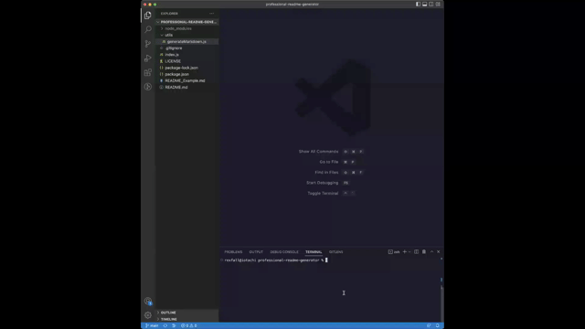
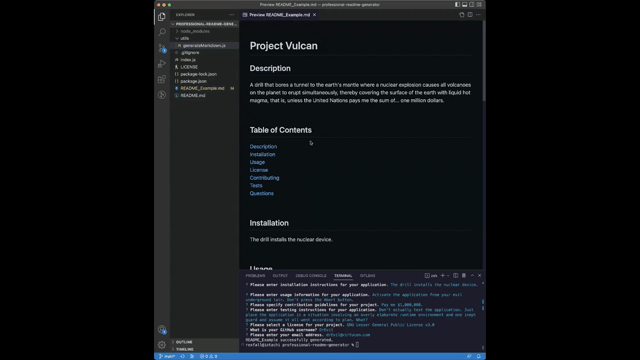

# Professional README Generator

## Technology Used 

| Technology Used         | Resource URL           | 
| ------------- |:-------------:| 
| Javascript   | [https://developer.mozilla.org/en-US/docs/Web/JavaScript](https://developer.mozilla.org/en-US/docs/Web/JavaScript) | 
| Node.js   | [https://nodejs.org/en/about/](https://nodejs.org/en/about/)      |   
| Inquirer | [https://www.npmjs.com/package/inquirer](https://www.npmjs.com/package/inquirer)     |  

<br/>

## Description 

[See the README Generator in Action](https://watch.screencastify.com/v/xOQq9roJOlKe4vuoiPbn)

This README generator runs in the Node.js Command Line Interface. It begins by prompting the user for information about a project using the npm Inquirer package. After gathering the necessary information, the generator dynamically creates a README file in Markdown, including functioning links. Information provided by the user is dynamically inserted within the README_Example.md file. Note that if a README_Example.md file already exists, the generator overwrites the existing file.

<br/>



<br/>

## Table of Contents

* [Code Refactor Example](#code-refactor-example)
* [Installation and Usage](#installation-and-usage)
* [Learning Points](#learning-points)
* [Author Info](#author-info)
* [Credits](#credits)
* [License](#license)

<br/>

## Code Refactor Example

The starter code for this project consisted of two JavaScript files: index.js and generateMarkdown.js. Although a single file would have been sufficient, one purpose of this project was to practice with modules (see [Learning Points](#learning-points), below). Each file contained empty arrays and functions, along with a set of to-do items (see the example below).

```JavaScript
// TODO: Include packages needed for this application

// TODO: Create an array of questions for user input
const questions = [];

// TODO: Create a function to write README file
function writeToFile(fileName, data) {}

// TODO: Create a function to initialize app
function init() {}
```

The code example below shows an example of one of the elements of the questions array. This array was used with the inquirer.prompt() method in the init() function to accept user input for an email address and validate that input.

```JavaScript
{
    type: "input",
    name: "email",
    message: "Please enter your email address.",
    validate: function (answer) {
        const valid = /^[\w]+[\w-\.!#$%^&*?<>]*@([\w-]+\.)+[\w-]{2,4}$/;
        if (valid.test(answer.trim())) {
            return true;
        } else {
            return "Please enter a valid email address.";
        }
    }
}
```

Similarly, the starter code included the definition of the function shown below in the generateMarkdown.js file; I added the code block within the function. The function returns a link in Markdown syntax to a description of the chosen license, using the name of the license as a placeholder.

```JavaScript
// TODO: Create a function that returns the license link
// If there is no license, return an empty string
function renderLicenseLink(license) {
  if (license === "None") {
    return "";
  } else {
    return `[${license}](${licenses[license].link})`;
  }
}
```

<br/>

## Installation and Usage 

### Installation

To install the Professional README Generator, [clone this repository](https://docs.github.com/en/repositories/creating-and-managing-repositories/cloning-a-repository) to your computer.

### Usage

Follow the steps below to run this application:
1. Using your Terminal, navigate to the directory containing this application.
2. Run the command ```node index.js``` in your terminal to launch the application.
3. Follow the prompts by entering the requested information.
4. The Professional README Generator automatically generates a new README_Example.md file using your input and responds with a confirmation of success, if successful, or the error encountered if unsuccessful.

<br/>



<br/>

## Learning Points 

This project gave me an opportunity to learn or further develop a number of skills:
* I practiced **modularization** in JavaScript--creating, exporting, importing, and using node modules.
* I learned how to use the **npm Inquirer** package by writing an array of question objects, calling the inquirer.prompt() method, and writing consuming code to handle the returned input.
* I practiced creating a file and appending content to it with the **File System (fs) module** in Node.js.

<br/>

## Author Info

### Ryan Moscoe 

* [Portfolio](https://rmoscoe.github.io/portfolio/)
* [LinkedIn](https://www.linkedin.com/in/ryan-moscoe-8652973/)
* [Github](https://github.com/rmoscoe)

<br/>

## Credits

Starter code provided by Trilogy Education Services, LLC, a 2U, Inc. brand, on behalf of the University of California, Berkeley Coding Boot Camp.

<br/>

## License

See respository for license information.